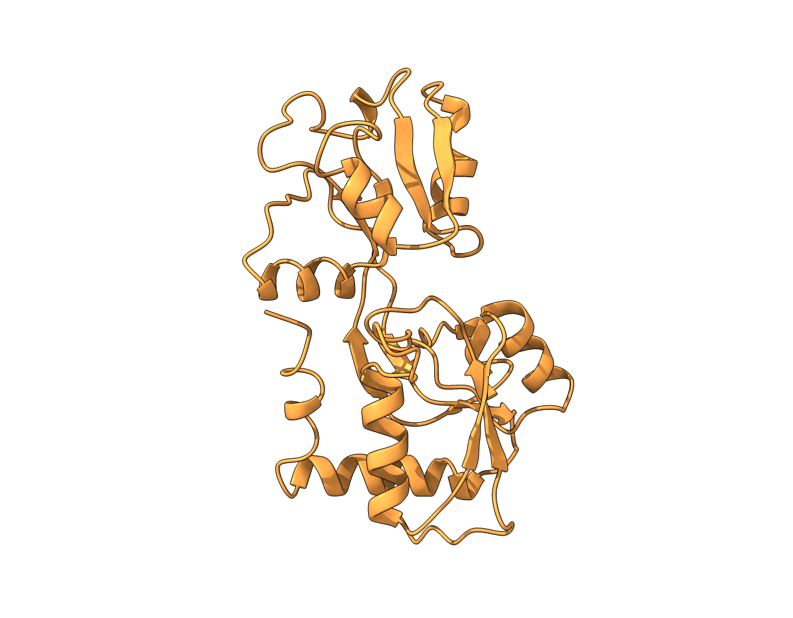

# ANM Protein Morph

A lightweight Python implementation of **Anisotropic Network Model (ANM)** normal mode analysis for exploring protein conformational dynamics.

This project computes collective protein motions from experimentally determined structures and generates physically relaxed conformational trajectories using OpenMM.

<p align="center">
  
</p>

*Lowest-frequency non-trivial normal mode of substrate binding domain 2 (SBD2) in open conformation (PDB: 4KR5), revealing a collective breathing motion of the structure.*

---

## Overview

Proteins are dynamic molecules that continuously fluctuate around their native structures. Low-frequency normal modes often capture biologically relevant collective motions such as domain movements, hinge motions, and breathing dynamics.

This repository implements a simple ANM workflow:

```text
PDB Structure
      ↓
 Cα Elastic Network
      ↓
   ANM Hessian
      ↓
 Normal Modes
      ↓
Mode Trajectory
      ↓
OpenMM Relaxation
      ↓
Relaxed Structural Ensemble
```

Unlike many existing implementations, the core ANM calculations are implemented directly in NumPy to provide a transparent and educational implementation of the method.

---

## Features

- ANM Hessian construction from Cα coordinates
- Normal mode calculation using NumPy
- Automatic identification of non-trivial modes
- Generation of conformational trajectories along selected modes
- Optional superposition of multiple modes
- Structure preparation using PDBFixer
- OpenMM-based structural relaxation
- Export of ChimeraX/PyMOL/VMD compatible trajectories
- Command-line interface

---

## Installation

Clone the repository:

```bash
git clone https://github.com/kiemax/anm-protein-morph.git
cd anm-protein-morph
```

Create a new environment:

```bash
conda create -n anm-protein-morph python=3.12
conda activate anm-protein-morph
```

Install the package:

```bash
pip install -e .
```

Install dependencies:

```bash
conda install -c conda-forge openmm pdbfixer
pip install numpy scipy matplotlib
```

---

## Quick Start

Generate a relaxed trajectory along the first non-trivial normal mode:

```bash
anm-morph \
    --pdb examples/4kr5_chainA.pdb \
    --modes 7 \
    --frames 11 \
    --max-rmsd 3.0
```

---

## Usage

### Single Mode

```bash
anm-morph \
    --pdb protein.pdb \
    --chain A \
    --modes 7
```

### Multiple Modes

Generate separate trajectories for several modes:

```bash
anm-morph \
    --pdb protein.pdb \
    --chain A \
    --modes 7 8 9
```

### Combined Modes

Generate a trajectory from a weighted combination of modes:

```bash
anm-morph \
    --pdb protein.pdb \
    --chain A \
    --modes 7 8 9 \
    --combine \
    --weights 1.0 0.5 -0.25
```

### Adjust Motion Amplitude

```bash
anm-morph \
    --pdb protein.pdb \
    --modes 7 \
    --max-rmsd 6.0
```

---


## Project Structure

```text
anm-protein-morph/
├── src/
│   └── anm_morph/
│       ├── anm.py
│       ├── morph.py
│       ├── pdb_io.py
│       ├── prepare.py
│       ├── relax.py
│       └── cli.py
├── examples/
├── docs/
├── pyproject.toml
└── README.md
```

---

## Scientific Background

The Anisotropic Network Model (ANM) represents a protein as an elastic network of Cα atoms connected by harmonic springs within a specified cutoff distance.

The Hessian matrix of the network is constructed and diagonalized to obtain collective normal modes. The lowest-frequency non-trivial modes often describe biologically meaningful conformational fluctuations.

**Reference**

Atilgan AR, Durell SR, Jernigan RL, Demirel MC, Keskin O, Bahar I. *Anisotropy of fluctuation dynamics of proteins with an elastic network model*. Biophysical Journal. 2001.

---

## Limitations

This project is intended as a lightweight educational implementation.

Current limitations include:

- Uniform spring constants
- Cα-only elastic network representation
- Harmonic approximation around a single structure
- Not intended as a substitute for molecular dynamics simulations

---
